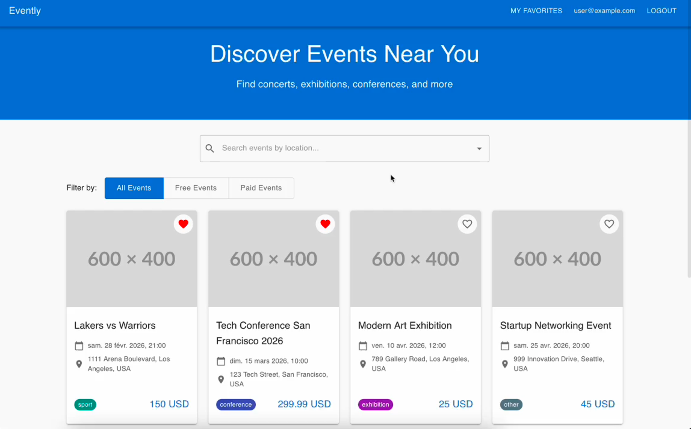

# Evently

This repository contains an application that has been generated by an agentic system.

[](https://aschen.ovh/evently-demo.mp4)


The applications started from templates:

- Nest.js for the backend
- React for the frontend

The following directory contains 100% autonomously generated code:

- [studio/src/app](studio/src/app)
- [api/src/features/events](api/src/features/events)
- [specifications](specifications)

The code has been generated autonomously from only 4 prompts.

It took 2 hours in total.

### Create the events page

```
Evently is an application to discover events near you.

The home page list events.

Each event is a card with the following information:

- Name
- Date
- Location (address of the event)
- Type (concert, exhibition, etc.)
- Price

You can search by location with autocompletion.

I don't have screenshot
```

### Add filters to the events page

```
On the Evently application, the events listed in the home page should be filterable by:

- event type
- free or paid event

```

### Add authentication page

```
On the Evently application, users should be able to login

Add link in the site header to login. Do not create a page to register.
```

### Favourite list

```
On the Evently application, you can save an event in your favorite list.

Evently users can directly add event to their list from the home page event listing.

Then, they can see their favorites events in a dedicated page
```
